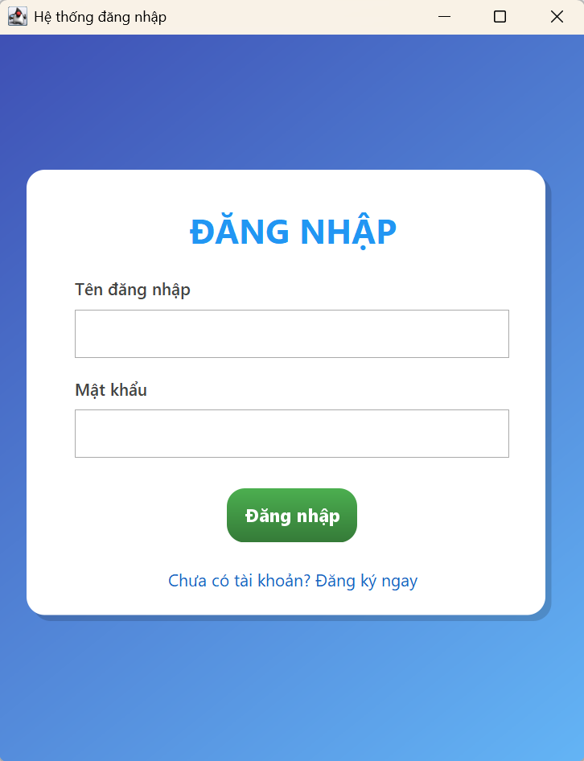
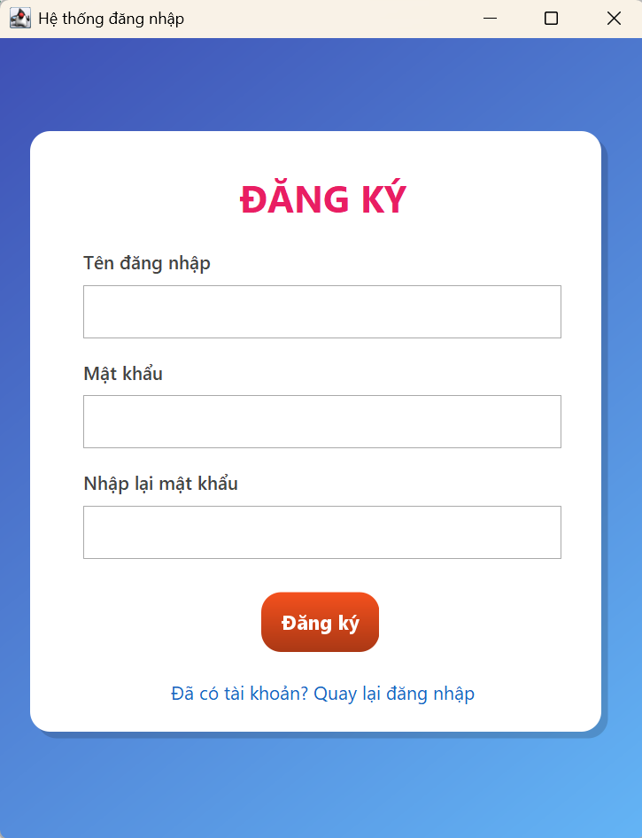
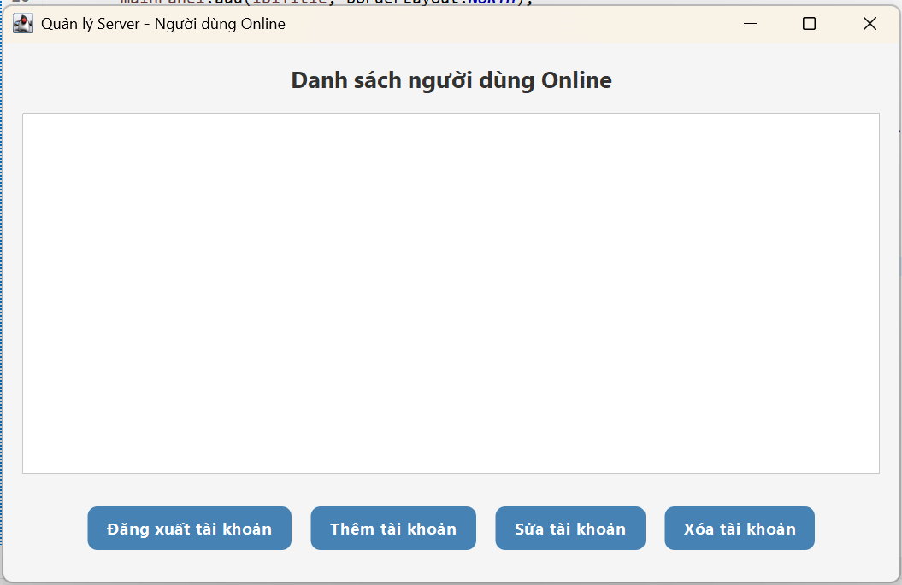

<h2 align="center">
    <a href="https://dainam.edu.vn/vi/khoa-cong-nghe-thong-tin">
    🎓 Faculty of Information Technology (DaiNam University)
    </a>
</h2>
<h2 align="center">
   Hệ thống đăng nhập Client-Server (TCP Socket + Java Swing)
</h2>

    

        
        
        
    

## 📖 1. Giới thiệu hệ thống
Hệ thống đăng nhập Client-Server được xây dựng dựa trên mô hình giao tiếp TCP Socket giữa máy khách (Client) và máy chủ (Server). Trong hệ thống này, Server lắng nghe tại cổng (port) 2712 để nhận và xử lý các yêu cầu từ phía Client. Người dùng phía Client sẽ thực hiện thao tác đăng nhập bằng cách nhập tên tài khoản và mật khẩu, sau đó thông tin này sẽ được gửi tới Server thông qua kết nối TCP.

Phía Server có giao diện quản lý tài khoản trực quan, cho phép Thêm, Sửa, Xoá dữ liệu người dùng. Dữ liệu này được lưu trữ và quản lý trong cơ sở dữ liệu MySQL, được kết nối bằng JDBC (Java Database Connectivity), đảm bảo tính an toàn và toàn vẹn dữ liệu.

## 🔧 2. Ngôn ngữ lập trình sử dụng  

 
 

Trong đó:  
- **Java**: ngôn ngữ chính để xây dựng Client và Server theo mô hình TCP Socket.  
- **MySQL**: hệ quản trị cơ sở dữ liệu lưu trữ thông tin tài khoản người dùng.  
- **JDBC**: cầu nối giữa ứng dụng Java và cơ sở dữ liệu MySQL.  

---

## 🖼️ 3. Một số hình ảnh hệ thống  

### 🔑 Giao diện đăng nhập từ Client  
  

### 🔏 Giao diện đăng ký từ Client  
  

### 🛠️ Giao diện Server quản lý tài khoản  
  

---
## 🛠️ 4. Các bước cài đặt

## 📞 5. Liên hệ cá nhân  
- 👤 Họ và tên: **ĐẶNG THANH BÌNH**  
- 🎓 Lớp: **CNTT 16-04**  
- 📧 Email: *dnagbinh12@gmail.com*  
- 📱 Số điện thoại: *0822968881*  
