<h2 align="center">
    <a href="https://dainam.edu.vn/vi/khoa-cong-nghe-thong-tin">
    🎓 Faculty of Information Technology (DaiNam University)
    </a>
</h2>
<h2 align="center">
   Hệ thống đăng nhập Client-Server
</h2>
<div align="center">
    <p align="center">
        
        
        
    </p>

[](https://www.facebook.com/DNUAIoTLab)
[](https://dainam.edu.vn/vi/khoa-cong-nghe-thong-tin)
[](https://dainam.edu.vn)

</div>

## 📖 1. Giới thiệu hệ thống
Hệ thống đăng nhập Client-Server được xây dựng dựa trên mô hình giao tiếp TCP Socket giữa máy khách (Client) và máy chủ (Server). Trong hệ thống này, Server sẽ nhận và xử lý các yêu cầu từ phía Client. Người dùng phía Client sẽ thực hiện thao tác đăng nhập bằng cách nhập tên tài khoản và mật khẩu, sau đó thông tin này sẽ được gửi tới Server thông qua kết nối TCP.
Phía Server có giao diện quản lý tài khoản trực quan, cho phép Thêm, Sửa, Xoá dữ liệu người dùng. Dữ liệu này được lưu trữ và quản lý trong cơ sở dữ liệu MySQL, được kết nối bằng JDBC (Java Database Connectivity), đảm bảo tính an toàn và toàn vẹn dữ liệu.

## 🔧 2. Công nghệ sử dụng   
<div align="center">

[](https://www.java.com/) 
[](https://www.mysql.com/) 
[](https://docs.oracle.com/javase/8/docs/technotes/guides/jdbc/)

</div>

Trong đó:  
- **Java**: ngôn ngữ chính để xây dựng Client và Server theo mô hình TCP Socket.  
- **MySQL**: hệ quản trị cơ sở dữ liệu lưu trữ thông tin tài khoản người dùng.  
- **JDBC**: cầu nối giữa ứng dụng Java và cơ sở dữ liệu MySQL.  

## 🖼️ 3. Một số hình ảnh hệ thống  


<div align="center">

<table>
  <tr>
    <td align="center">
      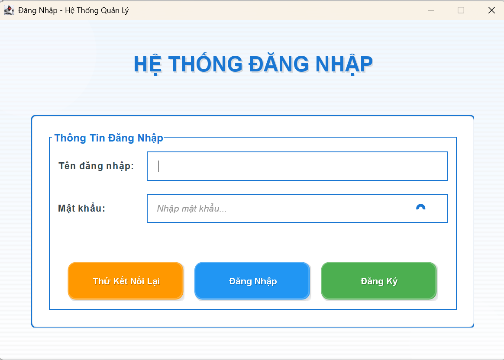<br/>
      <b>Giao diện đăng nhập</b>
    </td>
    <td align="center">
      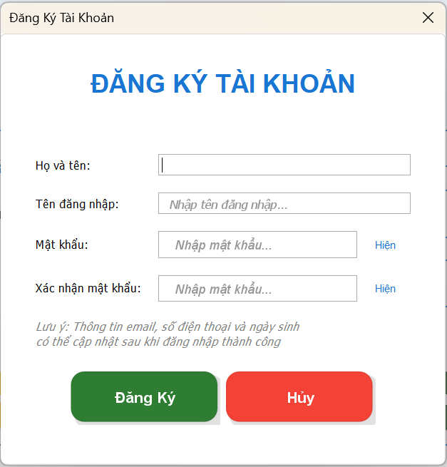<br/>
      <b>Giao diện đăng ký</b>
    </td>
  </tr>
  <tr>
    <td align="center">
      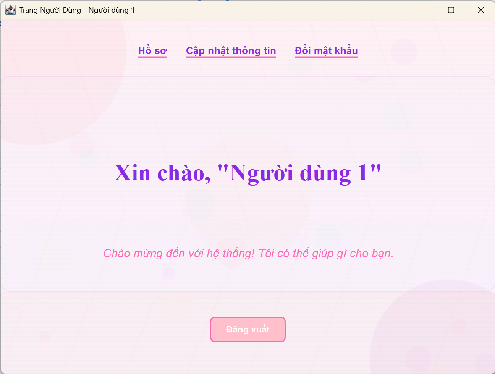<br/>
      <b>Giao diện User (màn hình chính)</b>
    </td>
    <td align="center">
      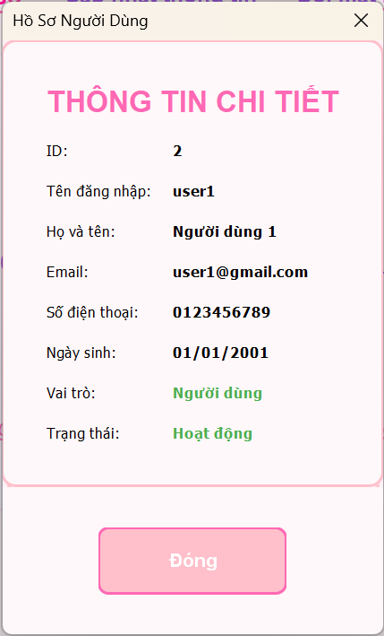<br/>
      <b>Thông tin hồ sơ</b>
    </td>
  </tr>
  <tr>
    <td align="center">
      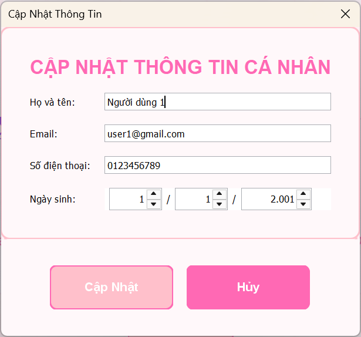<br/>
      <b>Sửa thông tin User</b>
    </td>
    <td align="center">
      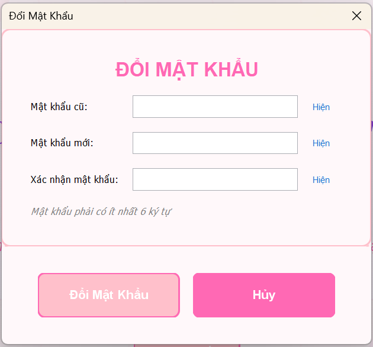<br/>
      <b>Đổi mật khẩu</b>
    </td>
  </tr>
</table>

</div>

<div align="center">

<table>
  <tr>
    <td align="center">
      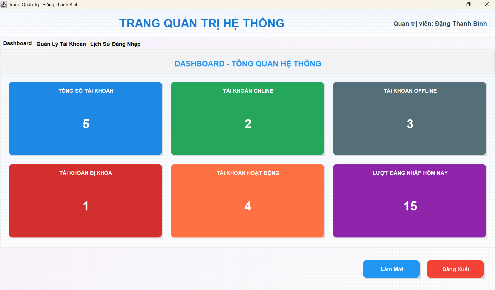<br/>
      <b>Giao diện Admin - Dashboard hệ thống</b>
    </td>
    <td align="center">
      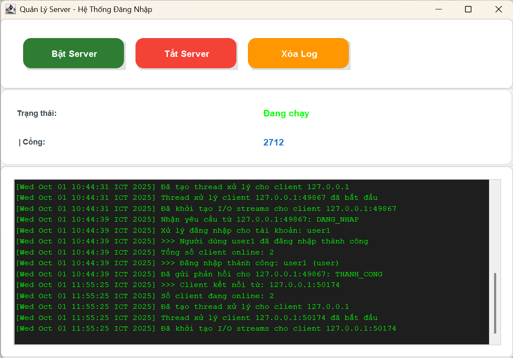<br/>
      <b>Màn hình chính của Server</b>
    </td>
  </tr>
  <tr>
    <td align="center">
      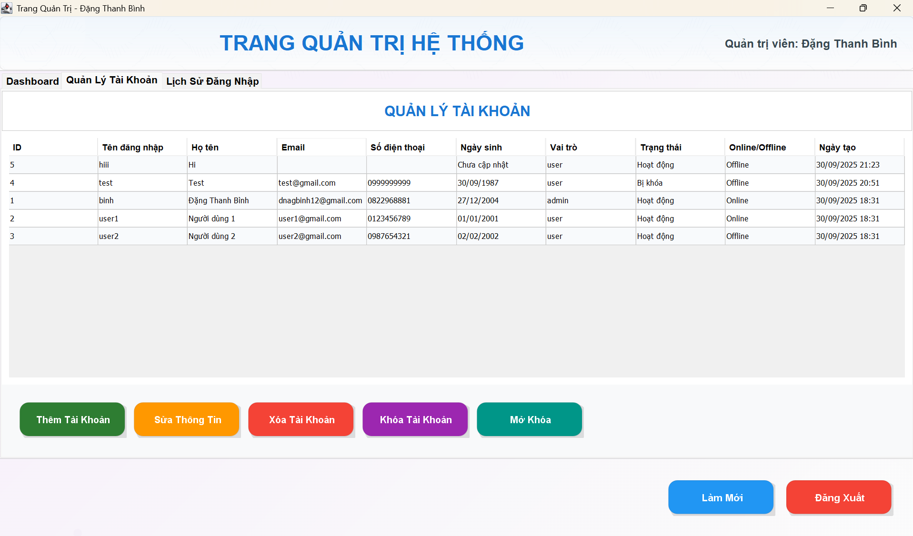<br/>
      <b>Giao diện Admin - Quản lý tài khoản</b>
    </td>
    <td align="center">
      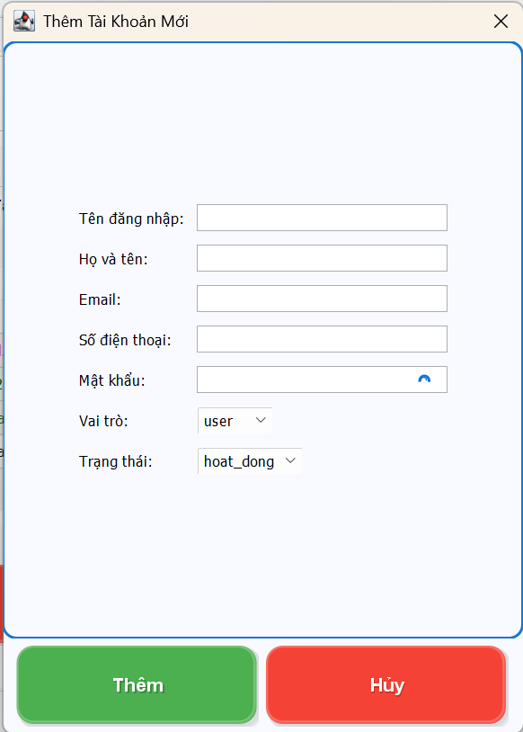<br/>
      <b>Thêm tài khoản mới</b>
    </td>
  </tr>
  <tr>
    <td align="center">
      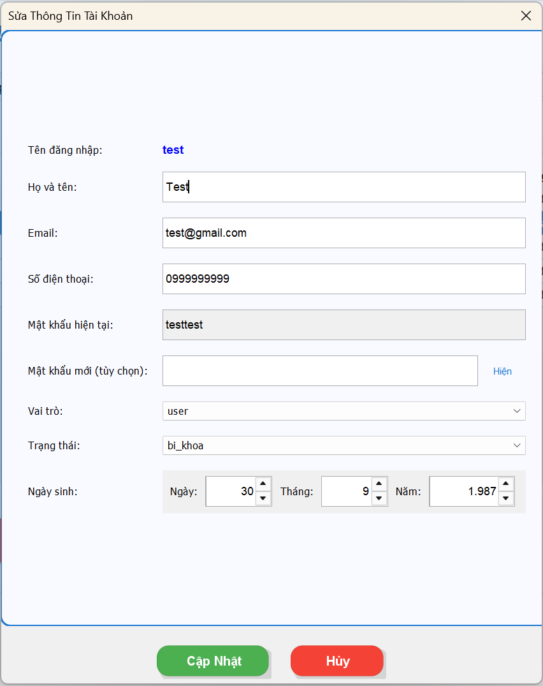<br/>
      <b>Cập nhật thông tin tài khoản</b>
    </td>
    <td align="center">
      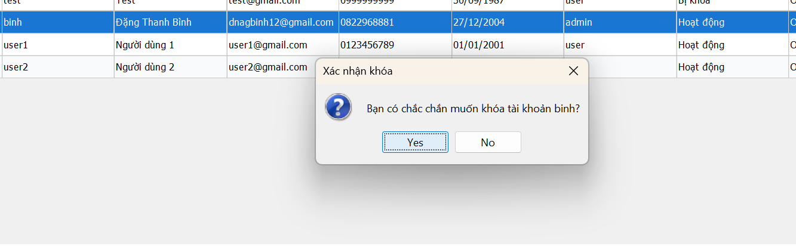<br/>
      <b>Xác nhận khóa tài khoản</b>
    </td>
  </tr>
  <tr>
    <td align="center">
      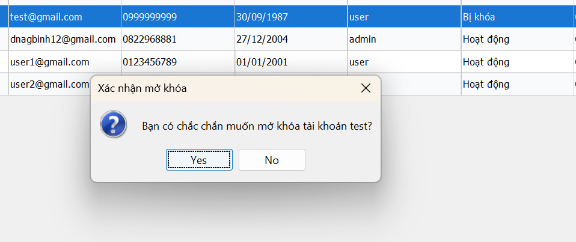<br/>
      <b>Xác nhận mở tài khoản</b>
    </td>
    <td align="center">
      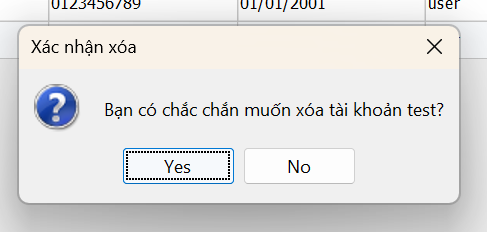<br/>
      <b>Xác nhận xóa tài khoản</b>
    </td>
  </tr>
  <tr>
    <td align="center">
      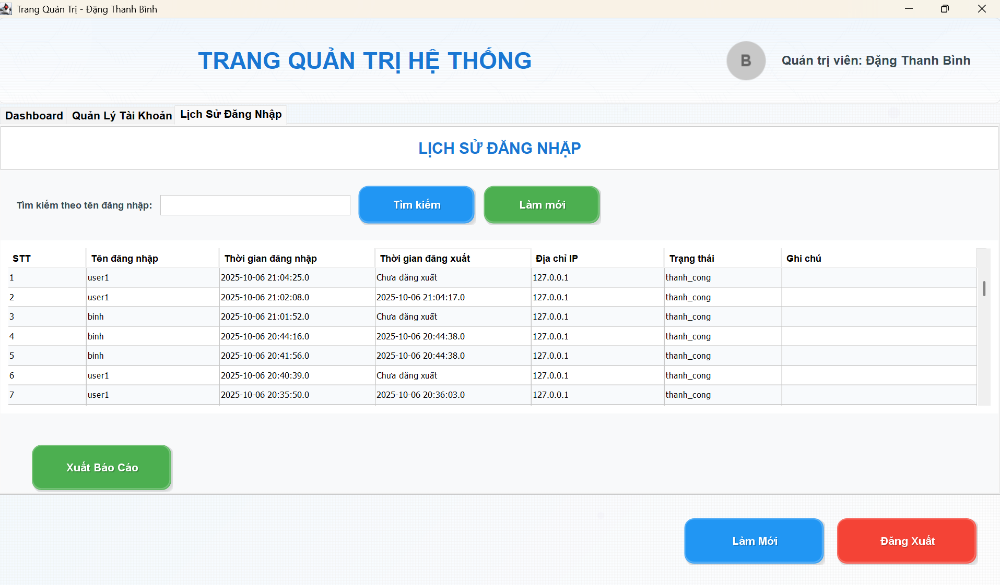<br/>
      <b>Giao diện Admin - Lịch sử đăng nhập</b>
    </td>
    <td align="center">
      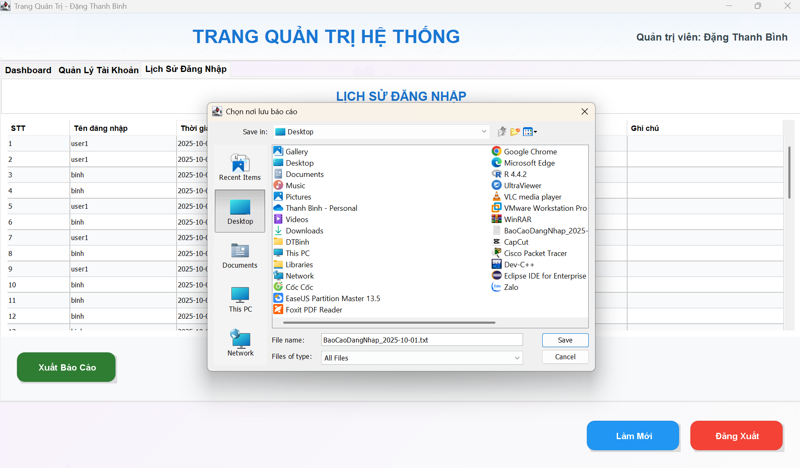<br/>
      <b>Xuất lịch sử đăng nhập</b>
    </td>
  </tr>
  <tr>
    <td align="center">
      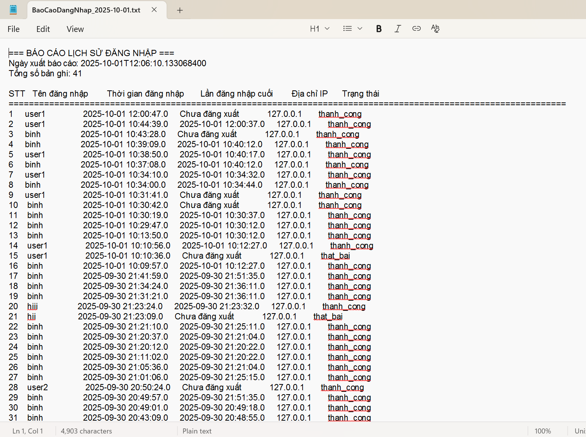<br/>
      <b>Báo cáo lịch sử đăng nhập đươc xuất ra file .txt</b>
    </td>
  </tr>
</table>

</div>

## 🛠️ 4. Các bước cài đặt
### 4.1. Cài đặt môi trường
- Cài đặt **JDK 8+**: [Download Java](https://www.oracle.com/java/technologies/javase-downloads.html)  
- Cài đặt **MySQL Server**: [Download MySQL](https://dev.mysql.com/downloads/)  
- Cài đặt **Git** (nếu chưa có): [Download Git](https://git-scm.com/downloads)  
- IDE khuyến nghị: **IntelliJ IDEA** hoặc **Eclipse**  
### 4.2. Clone source code
Mở terminal/cmd và chạy lệnh:  
```bash
git clone https://github.com/dtb0405/LTM-1604-D07-Sign-in-Client-Server.git
cd LTM-1604-D07-Sign-in-Client-Server
```
### 4.3. Khởi tạo cơ sở dữ liệu MySQL
Mở **MySQL Workbench** và chạy lệnh:
```sql
-- Tạo database cho hệ thống đăng nhập
CREATE DATABASE IF NOT EXISTS he_thong_dang_nhap;
USE he_thong_dang_nhap;

-- Bảng tài khoản người dùng
CREATE TABLE tai_khoan (
    id INT PRIMARY KEY AUTO_INCREMENT,
    ten_dang_nhap VARCHAR(50) UNIQUE NOT NULL,
    mat_khau VARCHAR(255) NOT NULL,
    ho_ten VARCHAR(100) NOT NULL,
    email VARCHAR(100),
    so_dien_thoai VARCHAR(15),
    ngay_sinh DATE,
    vai_tro ENUM('user', 'admin') DEFAULT 'user',
    trang_thai ENUM('hoat_dong', 'bi_khoa') DEFAULT 'hoat_dong',
    trang_thai_online ENUM('online', 'offline') DEFAULT 'offline',
    ngay_tao TIMESTAMP DEFAULT CURRENT_TIMESTAMP,
    lan_dang_nhap_cuoi TIMESTAMP NULL
);

-- Bảng lịch sử đăng nhập
CREATE TABLE lich_su_dang_nhap (
    id INT PRIMARY KEY AUTO_INCREMENT,
    tai_khoan_id INT,
    ten_dang_nhap VARCHAR(50),
    thoi_gian_dang_nhap TIMESTAMP DEFAULT CURRENT_TIMESTAMP,
    thoi_gian_dang_xuat TIMESTAMP NULL,
    dia_chi_ip VARCHAR(45),
    trang_thai ENUM('thanh_cong', 'that_bai') DEFAULT 'thanh_cong',
    ghi_chu TEXT,
    FOREIGN KEY (tai_khoan_id) REFERENCES tai_khoan(id) ON DELETE CASCADE
);

-- Tạo tài khoản admin mặc định
INSERT INTO tai_khoan (ten_dang_nhap, mat_khau, ho_ten, vai_tro) 
VALUES ('binh', 'binh', 'Đặng Thanh Bình', 'admin');

-- Tạo một số tài khoản user mẫu
INSERT INTO tai_khoan (ten_dang_nhap, mat_khau, ho_ten, email, vai_tro) 
VALUES 
('user1', 'user123', 'Nguyen Van A', 'nguyenvana@email.com', 'user'),
('user2', 'user123', 'Tran Thi B', 'tranthib@email.com', 'user');
```

### 4.4. Cấu Hình Kết Nối JDBC
1. Mở file `DBConnection.java` trong thư mục `Server`.
2. Cập nhật thông tin kết nối cơ sở dữ liệu MySQL như sau:
   ```java
   private static final String URL = "jdbc:mysql://localhost:3306/LoginDB?useSSL=false&allowPublicKeyRetrieval=true&serverTimezone=UTC";
   private static final String TEN_NGUOI_DUNG = "root";  // thay bằng user MySQL
   private static final String MAT_KHAU = "your_password";   
   ```
   - **URL**: Địa chỉ kết nối đến cơ sở dữ liệu MySQL (thay `LoginDB` nếu tên database khác).
   - **TEN_NGUOI_DUNG**: Tên người dùng MySQL (mặc định là `root`).
   - **MAT_KHAU**: Mật khẩu MySQL (thay `your_password` bằng mật khẩu thực tế của bạn).

### 4.5. Chạy Chương Trình
#### Chạy Server
1. Mở lớp `GiaoDienServer.java` trong thư mục `gui`.
2. Chạy chương trình (`Run`).
3. Bật Server, Server sẽ khởi động và lắng nghe kết nối trên **port 2712**.

#### Chạy Client
1. Mở lớp `ManHinhDangNhap.java` trong thư mục `gui`.
2. Chạy chương trình (`Run`).
3. Giao diện người dùng sẽ hiển thị, cho phép:
   - **Đăng nhập**: Nhập tài khoản và mật khẩu để đăng nhập.
   - **Đăng ký**: Nhập thông tin để tạo tài khoản mới.

### 4.6. Kiểm Tra Kết Quả
#### **Đăng nhập thành công:**
- **Server log:** Hiển thị thông tin kết nối chi tiết
  ```
  [2024-01-01 10:00:00] >>> Client kết nối từ: 192.168.1.100:54321
  [2024-01-01 10:00:01] >>> Người dùng admin đã đăng nhập thành công
  [2024-01-01 10:00:01] Tổng số client online: 1
  ```
- **Giao diện Server:** Hiển thị trạng thái "Đang chạy" và log real-time
- **Giao diện Client:** Chuyển đến giao diện tương ứng (User/Admin)

#### **Đăng ký tài khoản:**
- **Database:** Dữ liệu được lưu trực tiếp vào MySQL
  ```sql
  INSERT INTO tai_khoan (ho_ten, ten_dang_nhap, mat_khau, vai_tro, trang_thai, ngay_tao)
  VALUES ('Nguyễn Văn A', 'nguyenvana', 'hashed_password', 'user', 'hoat_dong', NOW());
  ```
- **Validation:** Kiểm tra tên đăng nhập trùng lặp
- **Mật khẩu:** Mã hóa an toàn trước khi lưu database

#### **Giao diện Server - Quản lý tài khoản:**

**🔹 Thêm người dùng:**
- **Hộp thoại:** Màu xanh dương với hoa văn chìm
- **Thông tin:** Họ tên, tên đăng nhập, mật khẩu, vai trò, trạng thái
- **Validation:** Kiểm tra tên đăng nhập trùng lặp, độ dài mật khẩu
- **Kết quả:** Tài khoản được tạo và hiển thị trong bảng quản lý

**🔹 Sửa thông tin người dùng:**
- **Hiển thị:** Thông tin hiện tại của tài khoản được chọn
- **Chỉnh sửa:** Có thể thay đổi họ tên, email, số điện thoại, ngày sinh
- **Mật khẩu:** Hiển thị mật khẩu hiện tại, cho phép đổi mật khẩu mới
- **Lưu:** Cập nhật thông tin vào database

**🔹 Xóa người dùng:**
- **Xác nhận:** Hộp thoại xác nhận trước khi xóa
- **Thông tin:** Hiển thị tên tài khoản sẽ bị xóa
- **Kết quả:** Tài khoản bị xóa khỏi database và bảng quản lý

**🔹 Khóa/Mở khóa tài khoản:**
- **Khóa:** Thay đổi trạng thái từ "hoat_dong" thành "bi_khoa"
- **Mở khóa:** Thay đổi trạng thái từ "bi_khoa" thành "hoat_dong"
- **Xác nhận:** Hộp thoại xác nhận trước khi thực hiện
- **Hiển thị:** Trạng thái được cập nhật trong bảng quản lý

#### **✅ Lịch sử đăng nhập:**
- **Ghi log:** Mọi lần đăng nhập/đăng xuất được ghi lại
- **Thông tin:** Tên đăng nhập, thời gian, địa chỉ IP, trạng thái, ghi chú
- **Hiển thị:** Bảng lịch sử với màu xen kẽ (xanh nhạt/trắng)
- **Xuất báo cáo:** Tạo file Excel với lịch sử đăng nhập

#### **Tính năng bảo mật:**
- **Mã hóa mật khẩu:** Sử dụng hash an toàn
- **Session management:** Theo dõi trạng thái đăng nhập
- **Logging:** Ghi lại mọi hoạt động của người dùng
- **Validation:** Kiểm tra dữ liệu đầu vào

#### **Giao diện người dùng:**
- **Theme:** Màu hồng cho User, màu xanh dương cho Admin
- **Responsive:** Tự động điều chỉnh kích thước
- **User-friendly:** Giao diện thân thiện, dễ sử dụng
- **Real-time:** Cập nhật thông tin ngay lập tức

#### **Kiểm tra toàn diện:**
1. **Kết nối:** Server và Client kết nối thành công
2. **Database:** Dữ liệu được lưu và truy xuất chính xác
3. **Giao diện:** Tất cả chức năng hoạt động bình thường
4. **Bảo mật:** Mật khẩu được mã hóa, session được quản lý
5. **Logging:** Mọi hoạt động được ghi lại chi tiết

## Lưu Ý
- Đảm bảo MySQL server đang chạy và cơ sở dữ liệu `he_thong_dang_nhap` đã được tạo trước khi chạy chương trình.
- Kiểm tra thông tin kết nối JDBC (URL, TEN_NGUOI_DUNG, MAT_KHAU) để đảm bảo chính xác.
- Server phải được chạy trước khi Client kết nối.

## 📞 5. Liên hệ cá nhân  
- 👨‍🎓 **Người thực hiện**: Đặng Thanh Bình
- 🎓 **Khoa**: Công nghệ thông tin – Trường Đại học Đại Nam
- 📞 **Số điện thoại**: 0822968881
- 📧 **Email**: dnagbinh12@gmail.com